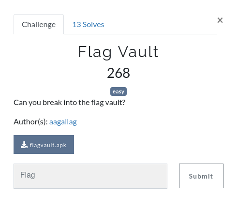

# BSidesPDX CTF 2020 - `flagvault`



> Can you break into the flag vault?

This challenge gives us an [APK file](flagvault.apk), which is an Android application bundle. I usually use [JADX](https://github.com/skylot/jadx) to reverse engineering Android apps.

Let's start by opening the APK in JADX and taking a look at the `MainActivity` in the `com.bsidespdx.flagvault` package:

```java
public class MainActivity extends AppCompatActivity {
    /* access modifiers changed from: protected */
    public void onCreate(Bundle bundle) {
        super.onCreate(bundle);
        setContentView((int) C0262R.layout.activity_main);
    }

    public void onDecrypt(View view) {
        TextView textView = (TextView) findViewById(C0262R.C0264id.vaultResult);
        String obj = ((EditText) findViewById(C0262R.C0264id.vaultPasswordEntry)).getText().toString();
        textView.setText(VaultManager.CheckPassword(obj) ? VaultManager.DecryptFlag(obj) : "Invalid vault password provided");
    }
}
```

There is also a `VaultManager` and `AES` activity that will come into play, as we see `VaultManager.CheckPassword()` and `.DecryptFlag()` being called.

Let's take a look at those functions in the `VaultManager` class:

```java
public class VaultManager {
    public static String cipherText = "e+aJggifvYOZCTlZKy6uVkuzqTnkJY4JCE45IG0vVIcK8D7+Smv5qqKpgfhuRuL3";

    public static boolean CheckPassword(String str) {
        if (str.length() == 26 && str.charAt(0) == 'l' && str.charAt(1) + str.charAt(2) == 217 && (str.charAt(0) ^ str.charAt(2)) == 24 && (str.charAt(1) ^ str.charAt(3)) == ':' && str.charAt(3) == str.charAt(6) && str.charAt(6) - '1' == str.charAt(9) && (str.charAt(4) ^ 'm') == 0 && str.charAt(5) + 8 == str.charAt(4) && (str.charAt(9) * 5) + (str.charAt(6) * 9) == 1085 && (str.charAt(6) * 8) - (str.charAt(7) * 3) == 445 && str.charAt(10) == str.charAt(0) && str.charAt(11) + 4 == 55) {
            if ((str.charAt(11) ^ str.charAt(12)) == 0 && str.charAt(2) == str.charAt(13) && str.charAt(4) == str.charAt(15) && str.charAt(16) == str.charAt(12) && str.charAt(14) == str.charAt(6) && str.charAt(17) == str.charAt(14) && str.substring(18, 20).equals(str.substring(7, 9).toUpperCase()) && str.charAt(20) * 9 == 297 && str.charAt(20) == str.charAt(21) && str.charAt(21) == str.charAt(22) && str.substring(20, 23).equals(str.substring(23, 26)) && str.charAt(8) * 1337 == 147070) {
                return true;
            }
            return false;
        }
        return false;
    }

    public static String DecryptFlag(String str) {
        return AES.decrypt(cipherText, str);
    }
}
```

The `CheckPassword()` function has a long lists of constraints that must be met by the input, and if it's successful `MainActivity` will call the `DecryptFlag()` function, which goes to AES to decrypt the Base64 value in `cipherText`. Now let's take a look at the AES class:

```java
public class AES {
    private static byte[] key;
    private static SecretKeySpec secretKey;

    public static void setKey(String str) {
        try {
            key = str.getBytes("UTF-8");
            byte[] digest = MessageDigest.getInstance("SHA-1").digest(key);
            key = digest;
            key = Arrays.copyOf(digest, 16);
            secretKey = new SecretKeySpec(key, "AES");
        } catch (NoSuchAlgorithmException e) {
            e.printStackTrace();
        } catch (UnsupportedEncodingException e2) {
            e2.printStackTrace();
        }
    }

    public static String encrypt(String str, String str2) {
        try {
            setKey(str2);
            Cipher instance = Cipher.getInstance("AES/ECB/PKCS5Padding");
            instance.init(1, secretKey);
            return Base64.getEncoder().encodeToString(instance.doFinal(str.getBytes("UTF-8")));
        } catch (Exception e) {
            PrintStream printStream = System.out;
            printStream.println("Error while encrypting: " + e.toString());
            return null;
        }
    }

    public static String decrypt(String str, String str2) {
        try {
            setKey(str2);
            Cipher instance = Cipher.getInstance("AES/ECB/PKCS5PADDING");
            instance.init(2, secretKey);
            return new String(instance.doFinal(Base64.getDecoder().decode(str)));
        } catch (Exception e) {
            PrintStream printStream = System.out;
            printStream.println("Error while decrypting: " + e.toString());
            return null;
        }
    }
}
```

In `decrypt()`, we see that the `str2` argument is passed to `setKey()`, which generates a secret key from the SHA-1 hash of the provided string (which comes from user input). Then, it uses AES-ECB to decrypt the Base64 payload in `str`.

After completing this reversing, we know the following:

* The user input is compared to a long list of constraints in `VaultManager`. If the input passes all of the checks, it will be used as a key for decryption.
* The AES-ECB key is the SHA-1 hash of the user input
* The ciphertext is a Base64 blog in `VaultManager`

There is just one large question left: How can we figure out what string fits the long list of constraints in `VaultManager`? Enter Z3.

[Z3](https://github.com/Z3Prover/z3) is a SMT (Satisfiability Modulo Theories) solver that provides a powerful interface to solve large systems of equations. We can use Z3 to represent all of the constraints as a series of equations, and allow it to do the hard work of figuring out what input will succeed. I won't be going in depth on how to use Z3 in this writeup, but there is a great guide that I reference when using Z3 [here](https://ericpony.github.io/z3py-tutorial/guide-examples.htm).

Most of the constraints are simple algebraic checks (e.g. `str.charAt(1) + str.charAt(2) == 217`), but some are more complex, like `str.substring(18, 20).equals(str.substring(7, 9).toUpperCase())`, which uses a couple Java functions in an expression that will evaluate to a boolean. To handle string comparisons, I individually added a constraint for each character that was being checked in the strings, and wrote a simple `toUpperCase()` function that represented the substraction done to each character to make it upper case (`'a' - 0x20 == 'A'`).

Then, once I had all of the constraints represented, I converted the output data from the solution and used it as the message for the SHA-1 hash that becomes the AES key. Please see [here](solve.py) for the full solution script.

When the script is run, it will print out the result from the Z3 solver, and then the decrypted flag.

```
$ python3 solve.py
let_me_in.l33t_m3_IN!!!!!!
BSidesPDX{g00d_crypt0_1s_h4rd_70_d0!>>}
```
