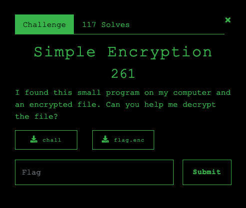

# Simple Encryption



> I found this small program on my computer and an encrypted file. Can you help me decrypt the file?

# Analysis

We are given two files, the binary (`chall`) and the encrypted flag (`flag.enc`). I opened up the binary in Ghidra but it had a long and complicated encryption function that I didn't want to look at yet, so I decided to do some experimenting with the program.

First, let's take a look at `flag.enc`:

```
$ xxd flag.enc
00000000: 7921 2331 1b3d 1715 273d 172d 2123 19bd  y!#1.=..'=.-!#..
00000010: ebeb 6dbf 2f21 1f35 bf0d 2115 bf27 2d29  ..m./!.5..!..'-)
00000020: 3537 bf17 2f2d 19bf 1925 3d27 27bf 392f  57../-...%=''.9/
00000030: 3d27 2735 2331 35a3 ebeb 572f 35bf 3327  =''5#15...W/5.3'
00000040: 3d31 bf0d 2115 bf3d 1b35 bf27 2121 292d  =1..!..=.5.'!!)-
00000050: 2331 bf33 211b bf2d 19bf 73b9 0959 9d25  #1.3!..-..s..Y.%
00000060: 1f27 9941 3523 391b 9d1f 179d 9f23 4133  .'.A5#9......#A3
00000070: 9f15 2337 419f 2341 319d 172f 153b bd05  ..#7A.#A1../.;..
00000080: eb
```

We see a lot of printable characters, but no obvious patterns.

Let's do some test encryptions:

```
$ echo "aaaaqwerty" > test.in
$ ./chall test.in test.out

_______ _____ _______  _____         _______
|______   |   |  |  | |_____] |      |______
______| __|__ |  |  | |       |_____ |______

_______ __   _ _______  ______ __   __  _____  _______  _____   ______
|______ | \  | |       |_____/   \_/   |_____]    |    |     | |_____/
|______ |  \_| |_____  |    \_    |    |          |    |_____| |    \_

$ xxd test.out
00000000: 3d3d 3d3d 1d11 351b 170d eb              ====..5....
```

We see that each `a` became `=`, so we know it's a fixed key or operation being used for each byte. With this knowledge, I wrote a scrip that would encrypt all printable characters and build a map between the character and the encrypted one, and used that to reverse the encryption done to the flag file:

```py
import string
import subprocess

alphabet = string.printable

with open("alpha.in", "w") as f:
    f.write(alphabet)

subprocess.run(["./chall", "alpha.in", "alpha.out"])

key = {}

with open("alpha.out", "rb") as f:
    for i in range(len(alphabet)):
        key[alphabet[i]] = f.read(1)

in_list = list(key.values())
out_list = list(key.keys())
flag = ""

with open("flag.enc", "rb") as f:
    data = f.read()

for d in data:
    b = bytes([d])
    assert(b in in_list)

    flag += out_list[in_list.index(b)]

print(flag)
```

```
$ ./solve.py

_______ _____ _______  _____         _______
|______   |   |  |  | |_____] |      |______
______| __|__ |  |  | |       |_____ |______

_______ __   _ _______  ______ __   __  _____  _______  _____   ______
|______ | \  | |       |_____/   \_/   |_____]    |    |     | |_____/
|______ |  \_| |_____  |    \_    |    |          |    |_____| |    \_

Congratulations!

I hope you liked this small challenge.

The flag you are looking for is F#{S1mpl3_encr1pt10n_f0und_0n_g1thub!}

```